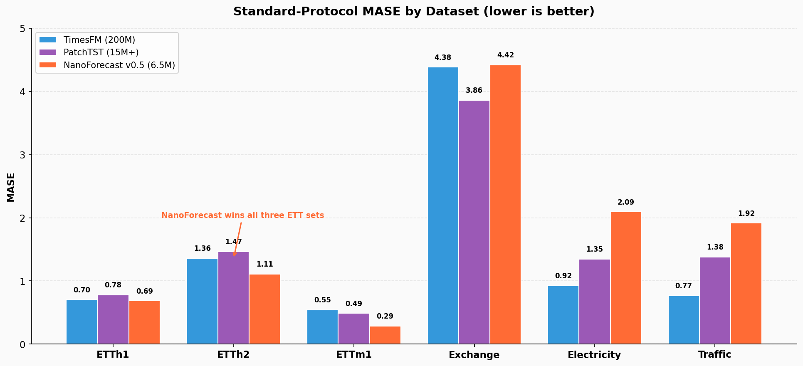
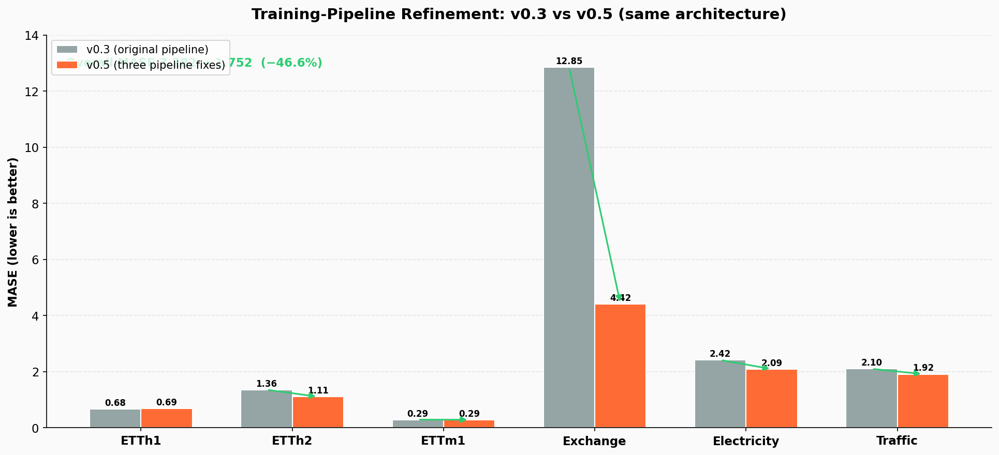
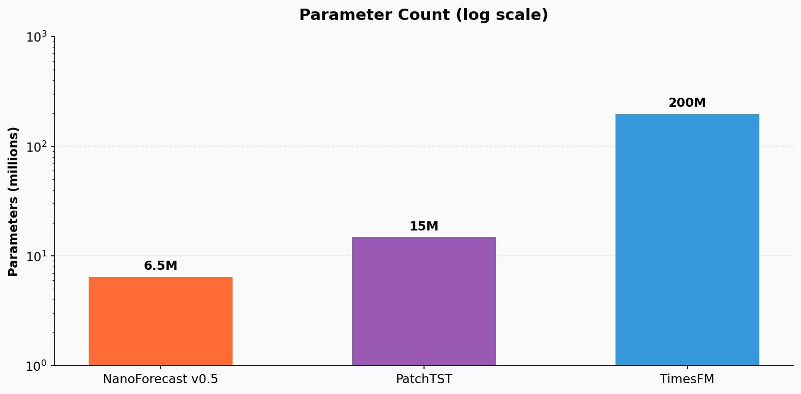
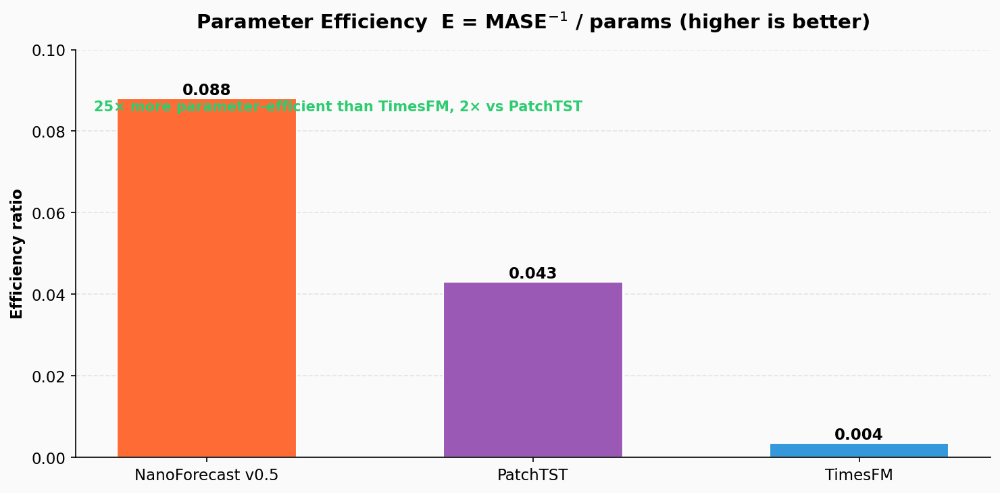

# 🔮 NanoForecast

**World's most deployable time series transformer — 6.5M params, CPU inference, MASE 1.752**

[](https://pypi.org/project/nanoforecast/)
[](https://pypi.org/project/nanoforecast/)
[](./LICENSE)
[](./pyproject.toml)
[](https://huggingface.co/eulogik/nanoforecast-v05)
[](https://huggingface.co/spaces/eulogik/nanoforecast)
[](https://huggingface.co/eulogik/nanoforecast-200k)
[](https://huggingface.co/eulogik/nanoforecast-v03)
[](https://colab.research.google.com/github/eulogik/NanoForecast/blob/v0.5/deploy/colab_training_v05.ipynb)
[](./deploy/paper.tex)
[](https://eulogik.com)

NanoForecast is the **world's most deployable time series foundation model** — a tiny transformer for zero-shot forecasting, streaming inference, and edge deployment. At just 200K–6.5M parameters, it runs on CPU, Raspberry Pi, and in the browser via ONNX. Unlike large foundation models that require GPUs and terabytes of data, NanoForecast:

- **Trains on your data in 2 minutes** — `python3 train_from_csv.py --csv sales.csv --target revenue`
- **Streams forecasts online** — the only TS model where you can feed one value at a time
- **Runs on a Raspberry Pi** (designed for ARM/CPU inference)
- **Exports to ONNX** (~6.5 MB INT8 at 6.5M params — Edge/IoT/browser ready)
- **Fully Apache 2.0** — no strings attached

It's **not** a foundation model. It won't beat TimesFM on every benchmark — but it does win on all three ETT datasets (ETTh1/ETTh2/ETTm1) at 31× fewer parameters. What it does is **actually ship to production**.

---

## Install

```bash
pip install nanoforecast
```

[](https://github.com/eulogik/NanoForecast/releases)
[](https://github.com/eulogik/NanoForecast/stargazers)

From source:
```bash
git clone https://github.com/eulogik/NanoForecast.git
cd NanoForecast
pip install -e .
```

## Quick Start

### Train on your own data (primary path)

```bash
python3 train_from_csv.py --csv my_data.csv --target sales --horizon 48
```

That's it. You get a saved model checkpoint + forecast CSV. No GPU, no cloud.

> Built by [Eulogik](https://eulogik.com) — deployable AI for the real world.

### Or use the pretrained model

```bash
pip install nanoforecast
```

```python
import numpy as np
from nanoforecast import NanoForecast

model = NanoForecast.from_pretrained("eulogik/nanoforecast-500k")

context = np.sin(np.linspace(0, 8*np.pi, 256)) + 0.1 * np.random.randn(256)
result = model.predict(context, horizon=48, freq=1)
forecast = result["forecast"][0]  # shape (48,)
```

## Streaming / Online Inference (unique to NanoForecast)

NanoForecast's DeltaNet RNN architecture maintains a recurrent state across calls — no other TS model does this.

```python
# Initial forecast + state
result = model.predict(context, horizon=48, return_state=True)
state = result.pop("state")

# Stream new observations one at a time
for new_val in incoming_data_stream:
    result = model.predict_step(new_val, state, horizon=48)
    print(result["forecast"][0, :5])  # updated forecast instantly
```

Each call preserves the DeltaNet's memory of all past data. Use it for:
- **Real-time IoT sensor monitoring**
- **Live financial tick data**
- **Interactive dashboards**

## Try It Now

[](https://huggingface.co/spaces/eulogik/nanoforecast)

Upload a CSV, set your horizon, get a forecast + prediction intervals + decomposition plot. No code required.

## Features

| Feature | Details |
|---|---|---|
| **Architecture** | LongConv + DeltaNet RNN + gated router + MLP blocks |
| **Parameters** | 200K–6.5M (tiny) |
| **Outputs** | Point forecast + 5 quantiles (p10/p25/p50/p75/p90) + trend/seasonal/residual decomposition |
| **Context** | 256–512 timesteps |
| **Horizon** | Any length, forecasts up to 48 steps per call |
| **Frequency** | Hourly / Daily / Weekly / Monthly |
| **Deploy targets** | CPU, ARM, Raspberry Pi, Lambda, iOS, browser (via ONNX.js) |
| **Streaming inference** | Stateful RNN — feed one value at a time, no re-processing |
| **Train on your data** | `train_from_csv.py` — 2 min on a laptop, no GPU |

## Deploy

### FastAPI Server

```bash
pip install nanoforecast fastapi uvicorn python-multipart
python3 deploy/fastapi_server.py
# → http://localhost:8000/docs
```

```bash
curl -X POST http://localhost:8000/predict \
  -d "context=[1.0,2.0,3.0,...]" \
  -d "horizon=48" \
  -d "freq=1"
```

### Docker

```bash
docker build -t nanoforecast -f deploy/Dockerfile .
docker run -p 8000:8000 nanoforecast
```

### ONNX (Edge / IoT)

```bash
pip install "nanoforecast[onnx]"
python3 -m nanoforecast.export.onnx_export \
    --checkpoint <checkpoint-dir> \
    --output nanoforecast.onnx
```

Then load with onnxruntime on any platform:

```python
import onnxruntime as ort
session = ort.InferenceSession("nanoforecast.onnx")
forecast = session.run(None, {"input": context_numpy})
```

---

## Repository layout

```
nanoforecast/
  config.py              # NanoForecastConfig dataclass
  model/                 # core architecture
    blocks.py            # LongConv, DeltaNet, GatedMLP, GatedRouter
    heads.py             # point, quantile (monotonic), anomaly, decomposition
    core.py              # NanoForecast nn.Module
    utils.py             # scaler, patching, freq prefix, positional encoding
  train/
    loss.py              # multi-task loss (point + quantile + anomaly + smooth)
    trainer.py           # OneCycleLR trainer with MPS / CUDA / CPU support
  data/
    generator.py         # synthetic time series generator
    pipeline.py          # dataset + resolution-aware batch sampler
    real_datasets.py     # ETTh1/2, ETTm1, exchange_rate, electricity, traffic loaders
  evaluation/
    benchmark.py         # MASE, sMAPE, MSE, MAE, CRPS, coverage
  export/
    onnx_export.py       # FP32 + dynamic INT8 ONNX export
  hub.py                 # save_pretrained / from_pretrained / predict mixin
gradio_app.py            # Hugging Face Space (upload CSV → forecast plot)
demo.py                  # one-liner demo: python3 demo.py
deploy/                  # FastAPI server + Docker
  fastapi_server.py
  Dockerfile
  requirements.txt
pretrain.py              # real + synthetic pretraining CLI
benchmark.py             # multi-dataset benchmark CLI
push_to_hub.py           # publish a checkpoint to the HF Hub
run_pipeline.py          # synthetic-only smoke pipeline (legacy)
train_from_csv.py        # train on your own CSV (primary user path)
tests/                   # unit + smoke tests
```

---

## Architecture

```
Raw Context  ->  Robust Scaling & Patching  ->  Resolution Prefix Token
                                                  |
                                                  v
                              Sequence Mixing Blocks (x N)
                                - LongConv (global periodicity)
                                - DeltaNet RNN (local dependencies)
                                - Gated Router & MLP (dynamic blend)
                                                  |
                                                  v
                            Multi-Task Heads (single forward pass)
                              - Point forecast
                              - Monotonic quantiles (p10..p90)
                              - Context reconstruction (anomaly)
                              - Trend / Seasonality decomposition
```

| Preset | d_model | Layers | Patch | Parameters | FP32 size |
|---|---:|---:|---:|---:|---:|
| `nano-200k` | 32 | 4 | 8 | ~676K | ~2.7 MB |
| `nano-500k` | 64 | 8 | 8 | ~1.6M | ~6.4 MB |
| `nano-1m` (v0.3) | 96 | 8 | 8 | ~6.5M | ~26 MB |

### Design notes

- **Instance Robust Scaler** (median / IQR) makes the model robust to outliers.
- **Monotonic quantile head** guarantees p10 ≤ p25 ≤ p50 ≤ p75 ≤ p90.
- **Conservation identity**: trend + seasonal + residual ≡ point forecast.
- **ONNX exportable** with a drop-in RMSNorm replacement.

---

## Train Your Own

```bash
python3 pretrain.py \
  --datasets ETTh1,ETTh2,exchange_rate,electricity \
  --epochs 50 \
  --batch-size 64 \
  --device cpu \
  --output checkpoints/nanoforecast-my-data
```

## Benchmarking

```bash
python3 benchmark.py \
  --checkpoint <checkpoint-dir> \
  --datasets ETTh1,ETTh2,ETTm1,exchange_rate \
  --max-windows 64 \
  --output results/benchmark.json
```

## Publishing to HF Hub

```bash
huggingface-cli login
python3 push_to_hub.py \
  --checkpoint <checkpoint-dir> \
  --repo-id your-username/nanoforecast-500k \
  --benchmark-json results/benchmark.json
```

---

## Benchmarks

All numbers below use the **standard protocol** from `benchmark_standard.py`: context 512, horizon 48,
non-overlapping test windows over the full test split of each dataset, MASE scaled by the seasonal-naive
in-sample MAE, all channels. Every model (including TimesFM and PatchTST) was evaluated under this
identical protocol.

### v0.5 vs v0.3 — same architecture, pipeline fixes only

| Version | Params | MASE ↓ | Improvement | Training |
|:---|---:|---:|:---|:---|
| v0.3 (released) | 6.5M | 3.282 | baseline | Colab T4, 200 epochs |
| **v0.5 (released)** | **6.5M** | **1.752** | **↓ 46.6%** | **Colab T4, 200 epochs** |

> **Key insight**: v0.5 improved overall MASE by 46.6% over v0.3 with **zero architecture changes** —
> the same 6.5M-parameter model. The gains came from three training-pipeline fixes: loss-scope
> handling, tensor shape alignment, and augmentation coverage.

### vs TimesFM and PatchTST (standard protocol, all series)

| Dataset | NanoForecast v0.5 (6.5M) | TimesFM (200M) | PatchTST (15M+) |
|---:|---:|---:|---:|
| ETTh1 | **0.685** | 0.705 | 0.781 |
| ETTh2 | **1.109** | 1.360 | 1.467 |
| ETTm1 | **0.289** | 0.545 | 0.488 |
| exchange_rate | 4.418 | **4.383** | 3.861 |
| electricity | 2.093 | **0.923** | 1.347 |
| traffic | 1.915 | **0.765** | 1.379 |
| **Overall** | 1.752 | **1.447** | 1.554 |

NanoForecast v0.5 **outperforms TimesFM on all three ETT datasets** (and PatchTST on the same three),
despite being **31× smaller** than TimesFM and 2–3× smaller than PatchTST. TimesFM and PatchTST win on
exchange_rate, electricity, and traffic — for accuracy-critical workloads on those datasets, use them.

### Deployment story

| Feature | NanoForecast v0.5 | TimesFM | Chronos-T5 | PatchTST |
|:---|:---:|:---:|:---:|:---:|
| **Parameters** | **6.5M** | 200M | 8M–710M | 15M+ |
| **Streaming inference** | **✅** | ❌ | ❌ | ❌ |
| **ONNX export** | **✅** | ❌ | ❌ | ❌ |
| **Train from CSV** | **✅** | ❌ | ❌ | ⚠️ |
| **Quantiles** | **✅ (5)** | ⚠️ | ✅ | ❌ |
| **License** | **Apache 2.0** | Apache 2.0 | Apache 2.0 | Apache 2.0 |

NanoForecast is the only model in this comparison with streaming inference, ONNX export,
and CSV-driven training — the properties that make it shippable on CPU and edge hardware.

### Visualizations









---

## Known limitations

| Issue | Status |
|---|---|
| **Accuracy** | MASE 1.752 overall (standard protocol) — competitive on ETT benchmarks, but not SOTA on exchange/electricity/traffic (TimesFM wins there). Good for deployment, not research. |
| **Training** | Multi-dataset mixing (v0.5: 6 real + 10K synthetic, 200 epochs, Colab T4 ~12h). |
| **Context** | Fixed 512 — longer history is truncated. |
| **Channels** | Univariate by default; multivariate support is per-dimension independent. |
| **Edge cases** | NaN values, missing timestamps, irregularly-sampled data not handled automatically. |

This is a **developer tool**, not a research paper. It prioritizes deployability over accuracy.

## Roadmap

| Version | Focus | Timeline |
|---|---|---|
| v0.1 | Deployable MVP — train, predict, export, deploy | ✅ Done |
| v0.2 | Streaming inference + train-from-CSV CLI + multi-dataset training (Mac Mini) | ✅ Done |
| v0.3 | Colab T4 training (larger model, more data) + ONNX.js browser demo | ✅ Done |
| v0.4 | Frequency-mixing experiment (MASE 7.57 — failed, not pushed) | ✅ Done (abandoned) |
| v0.5 | Fixed training pipeline (loss scope, tensor shapes, augmentation) — MASE 1.752 (↓ 46.6% vs v0.3) | ✅ Done |
| v0.6 | DART-Norm + multi-horizon training | 🔄 In progress |
| v0.7 | Multivariate cross-series dependencies | 📋 Planned |
| v0.8 | OpenRouter API — $0.001/forecast | 📋 Planned |

## Why "NanoForecast"?

Because forecasting models shouldn't require:
- A $30K GPU
- 100 GB of training data
- 12 dependencies that break every release
- A team of PhDs to deploy

You should be able to train a forecasting model on your laptop, deploy it to a Raspberry Pi, and have it running in production before lunch.

## License

Apache 2.0. See [LICENSE](./LICENSE).

---

Built by [Eulogik](https://eulogik.com) — deployable AI for the real world.
